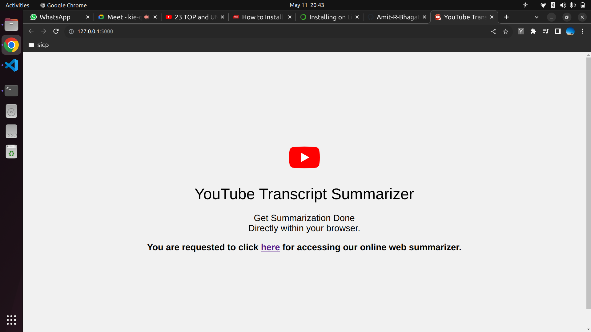
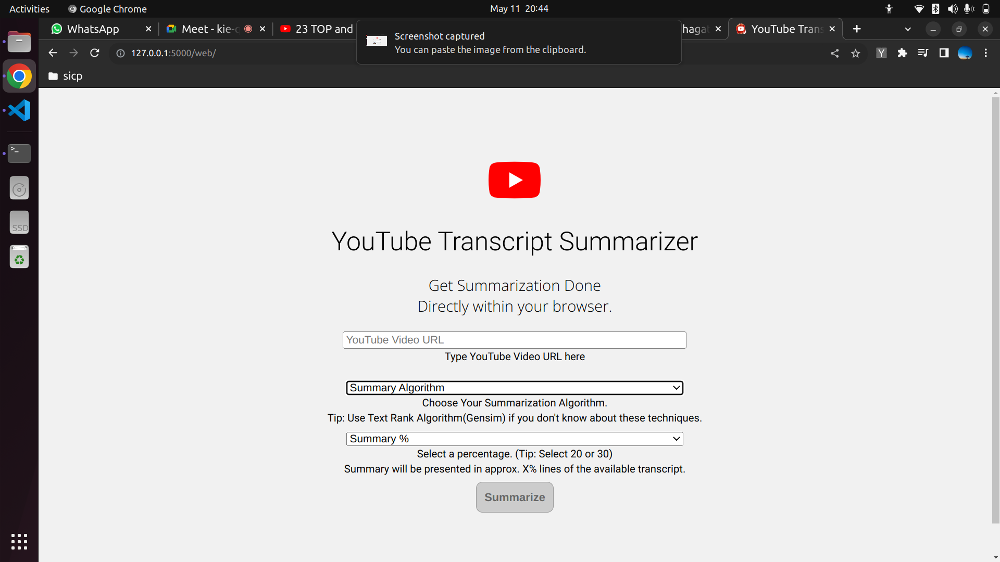
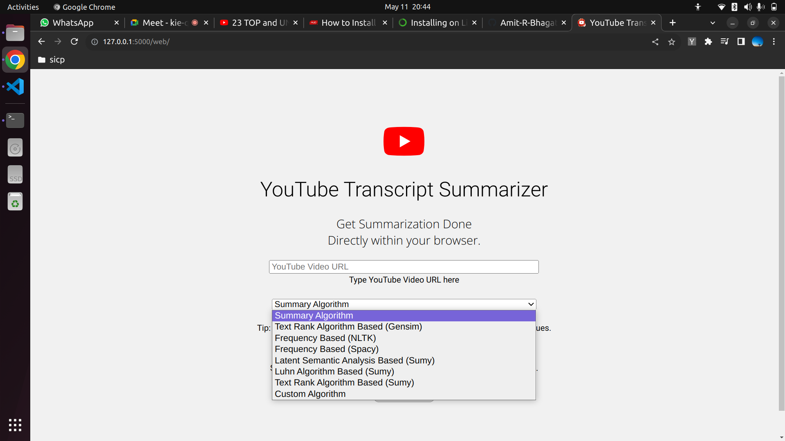
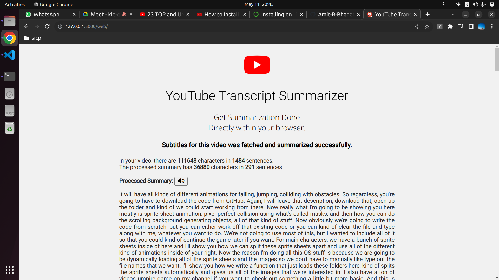
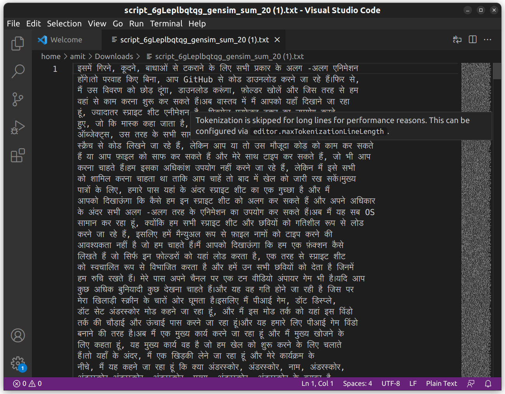
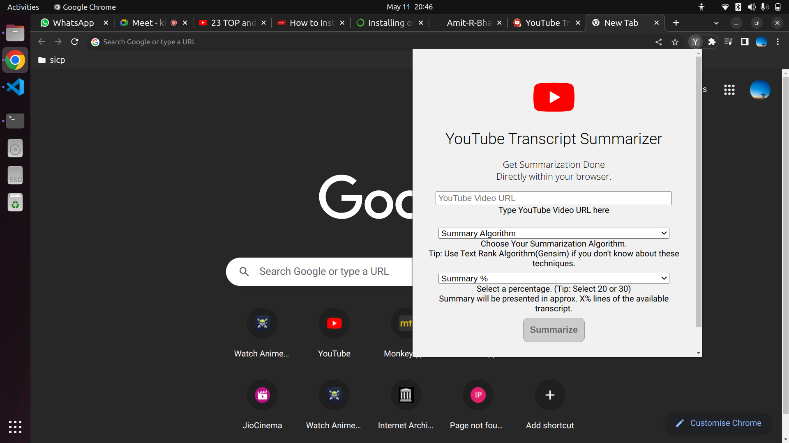

## Setup on Linux

### Pre-requisites
+ python3
```
sudo apt install python3
```
+ miniconda
```
- Download Miniconda3 Installer for linux from https://docs.conda.io/en/latest/miniconda.html#linux-installers

chmod 400 Miniconda3-latest-Linux-x86_64.sh

bash Miniconda3-latest-Linux-x86_64.sh

Test Installation by running
conda list
```

### Project setup
```
git clone https://github.com/Amit-R-Bhagat/yt-summarizer.git

cd yt-summarizer

// This will create a conda python env called project
conda env create --file environment.yml

conda activate project

// This runs the server
python3 app.py

```

## Screenshots
#### Homepage
<br />


____________________

### WebView
<br/>


_____________________

### Summarization Algorithms
<br/>


_______________________

### Result
<br/>


______________________

### Language Translation
<br/>


______________________________

### Extension
<br/>

